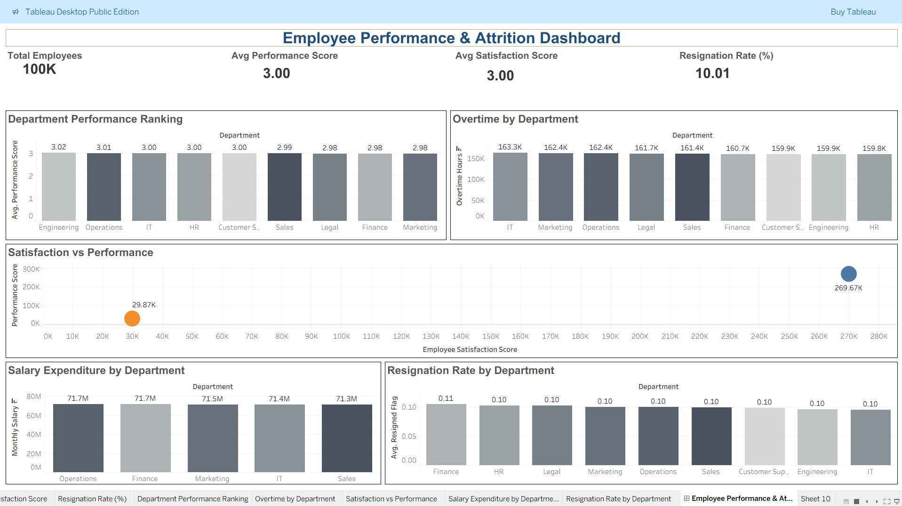

# Employee Performance & Attrition Dashboard

## Overview

Analyzed employee workforce data using SQL and developed an interactive Tableau dashboard to evaluate employee performance, satisfaction, overtime utilization, salary expenditure, and attrition trends.

The project focuses on identifying high-performing departments, workforce productivity patterns, employee retention risks, and factors influencing resignation.

## Tools

* SQL (MySQL)
* Tableau Public
* Microsoft Excel

## Live Dashboard

🔗 Tableau Public Dashboard: [[Add Your Tableau Public Link Here](https://public.tableau.com/app/profile/ashwin.r4543/viz/EmployeePerformanceandAttritionDashboard/EmployeePerformanceAttritionDashboard?publish=yes)]

## Dataset

* Employee Performance Dataset
* 13,000+ Records (Approx.)

## SQL Analysis

Performed workforce analytics using SQL, including:

* Employees by Department
* Average Performance Score by Department
* Department Productivity Analysis
* Average Salary by Department
* Top Performing Job Roles
* Top Employees by Performance Score
* Employees Below Company Average Performance
* Training Hours vs Performance Analysis
* Overtime Analysis by Department
* Salary Expenditure by Department
* High Performance Employee Percentage
* Employee Satisfaction vs Resignation Analysis
* High-Risk Employee Identification
* Department Attrition Analysis

## Dashboard Features

### KPIs

* Total Employees
* Average Performance Score
* Average Satisfaction Score
* Resignation Rate (%)

### Visualizations

* Department Performance Ranking
* Overtime Hours by Department
* Satisfaction vs Performance Analysis
* Salary Expenditure by Department
* Resignation Rate by Department

### Filters

* Department
* Job Title

## Key Insights

* Identified departments with the highest and lowest employee performance.
* Evaluated overtime distribution across departments.
* Analyzed employee satisfaction and its relationship with resignation.
* Highlighted departments with elevated attrition risk.
* Measured salary expenditure across departments.
* Identified workforce segments requiring management attention.

## Dashboard Preview

## Project Structure

Employee-Performance-Attrition-Dashboard/

├── Dataset/

├── SQL/

│   └── employee_analysis.sql

├── Dashboard/

│   ├── Dashboard.png

│   └── Employee_Performance_Dashboard.twbx

└── README.md

## Author

Ashwin

